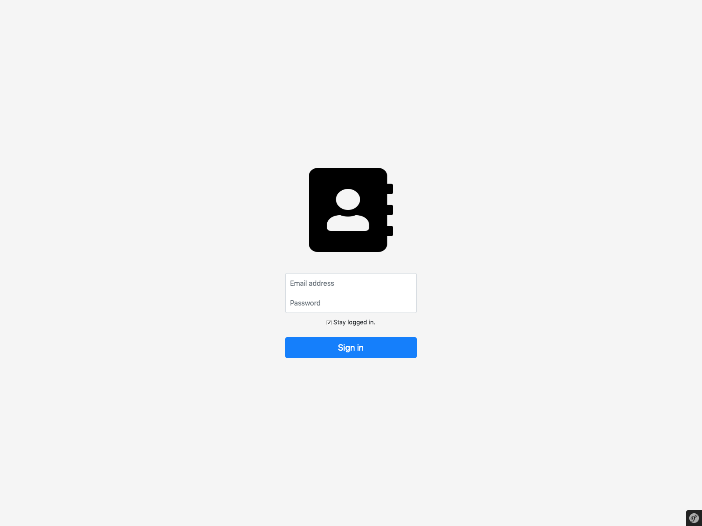
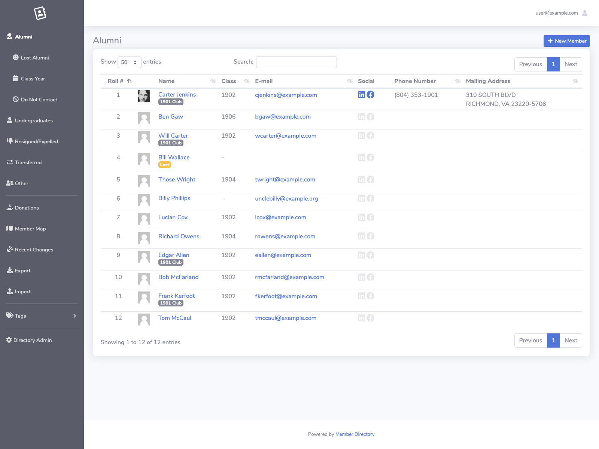
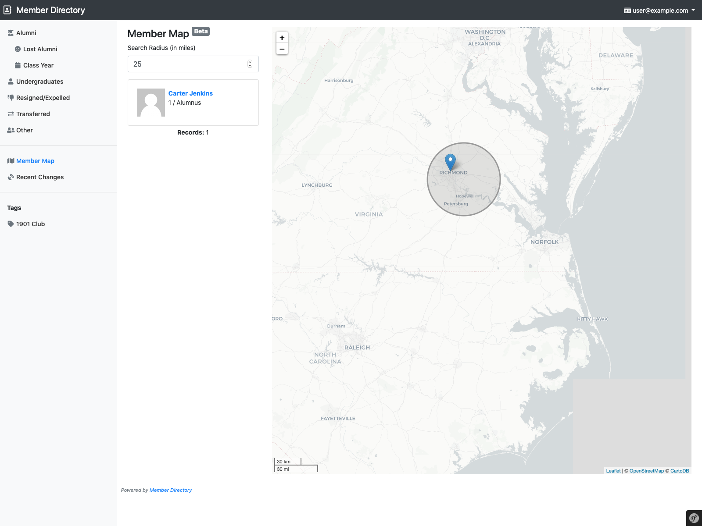
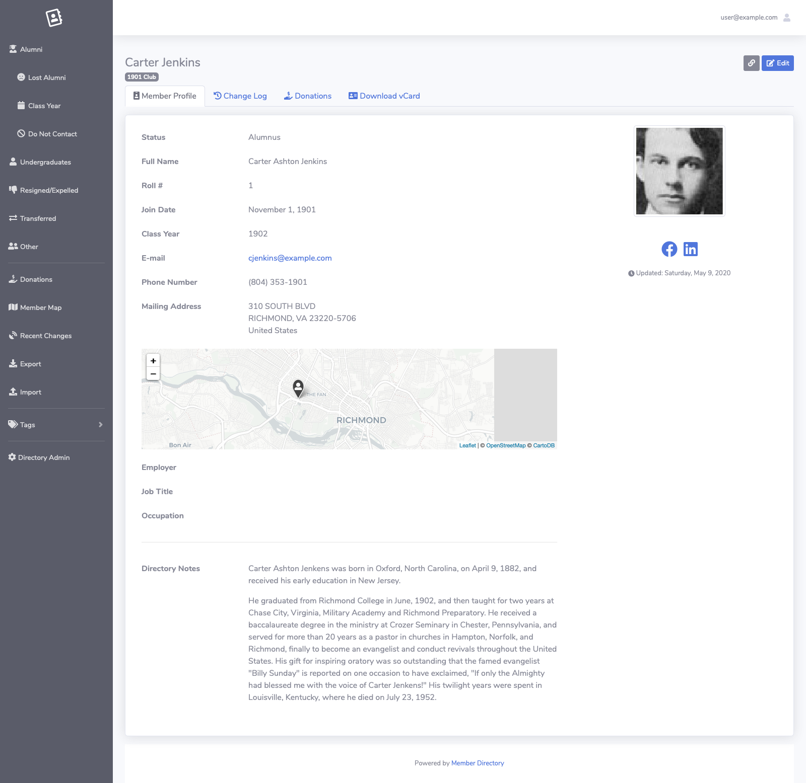
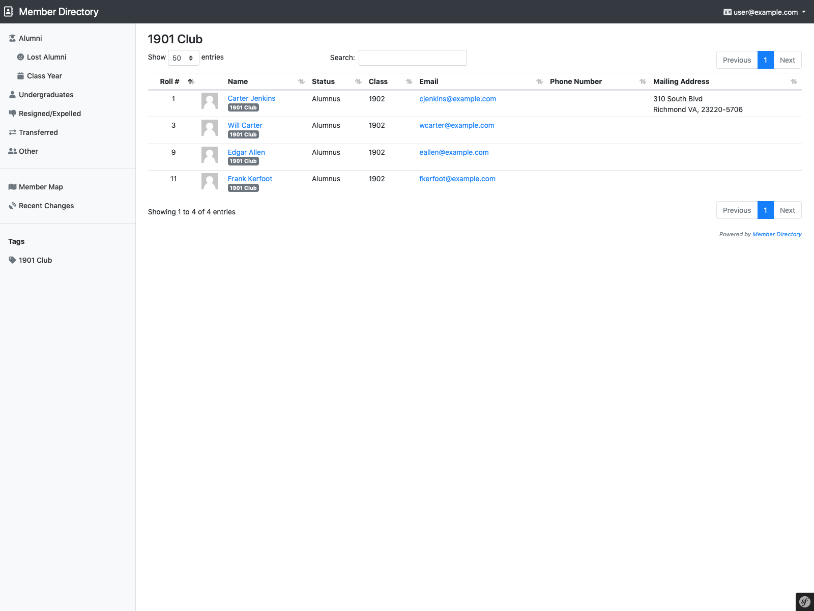
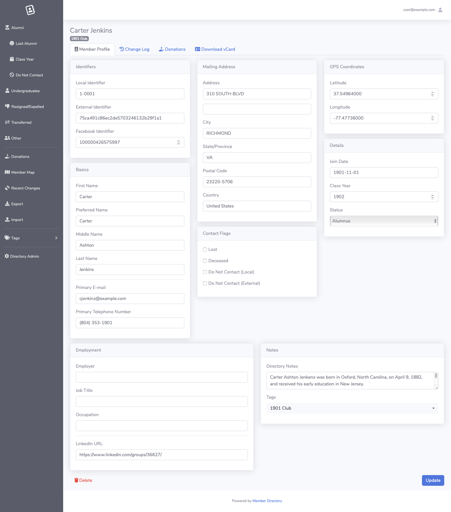
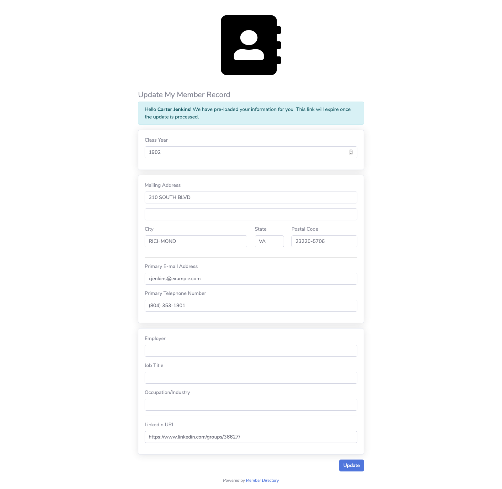

# Member Directory

Member Directory is a [Symfony](https://symfony.com/) 4 project to manage the membership records of a local chapter of a larger, national organization. It has a handful of useful features:

* **CSV imports** that update records based on a common identifier
* **Email subscription management** through [Campaign Monitor](https://www.campaignmonitor.com/)
* **Mailing address validation** through the USPS
* **Geolocation and mapping** through Census data in the United States
* **Tagging** of membership records to indicate committees or extra data
* **Data exports** through an administrative tool

## [Developer Quick Start](https://github.com/stephenyeargin/member-directory/wiki/Developer-Quick-Start)

## Feature Screenshots

### Login Access

### Member Directory

### Interactive Map

### Member Profile

### Record Tagging

### Admin Role for Updates

### Self-Service Update via Unique Link

